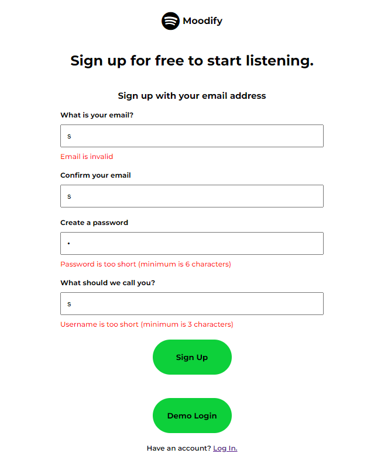
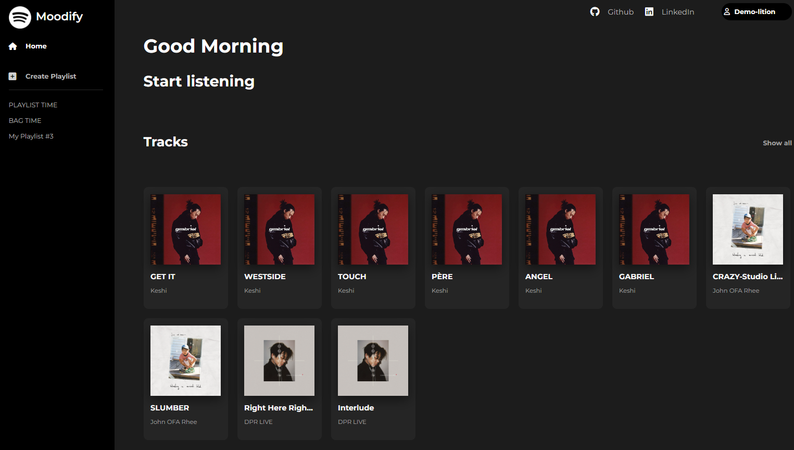
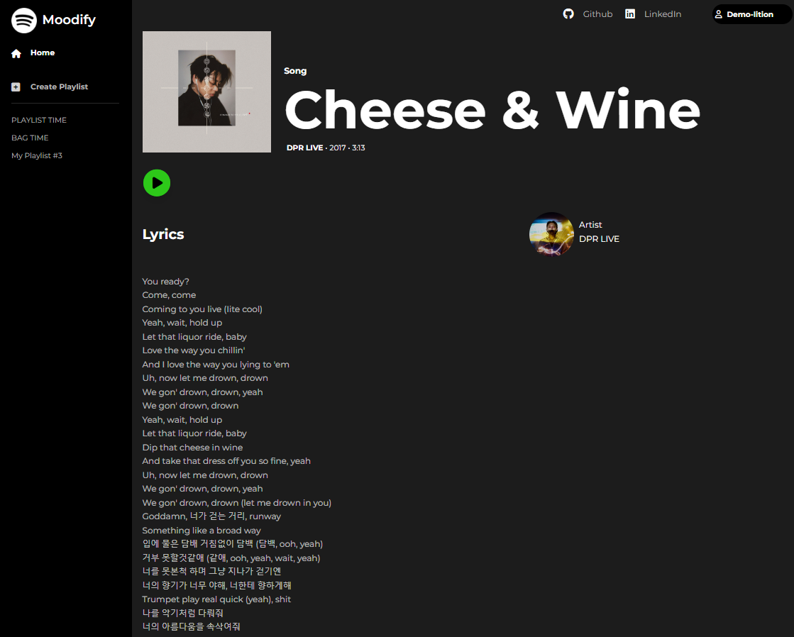
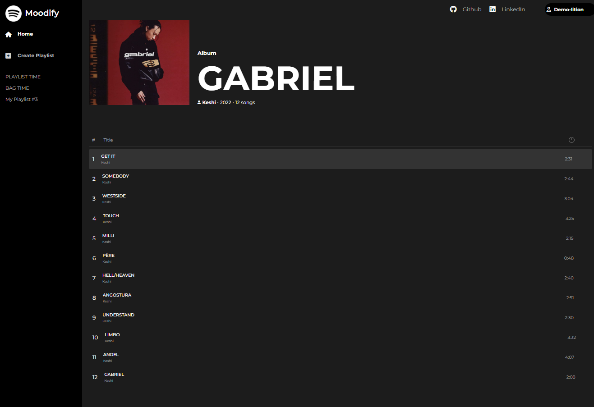
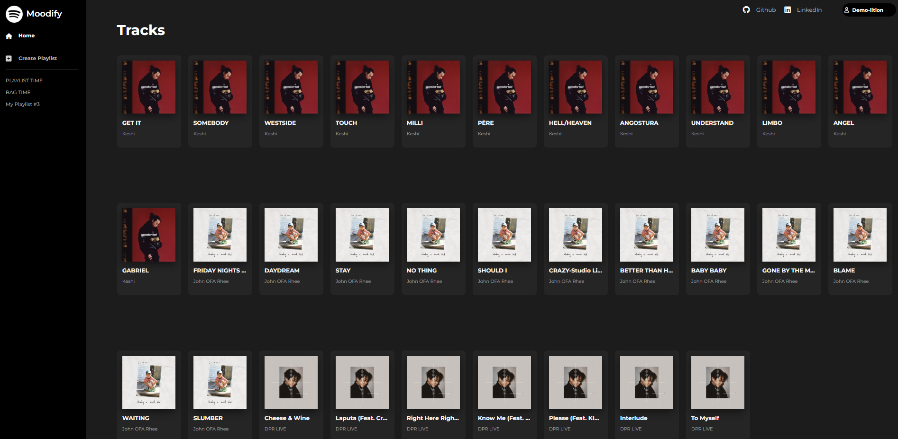
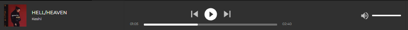
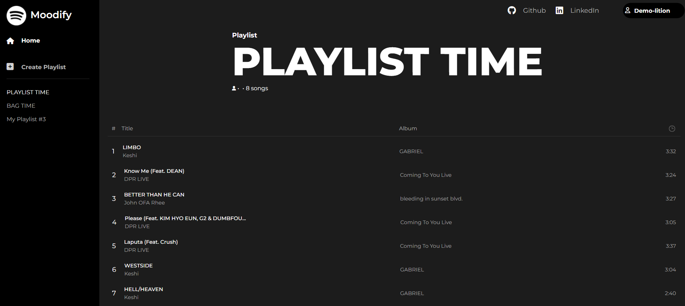
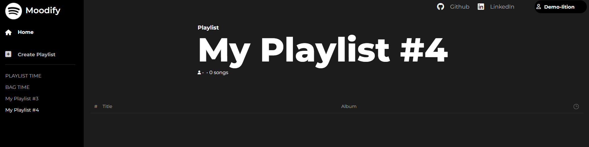

# WELCOME TO MOODIFY

Check out the [live site](https://moodify-13eb.onrender.com/)!

## Introduction ##

Moodify is a clone of the Spotify App. Spotify is a subscription music streaming service that offers users a vast library of music,podcasts, and more. Spotify users can view tracks, albums, and playlists of different artists. It also curates playlists based on your preferences and selection of music. As someone who is passionate about music, I was interested in building a music streaming platform similar to Spotify that enables its users to explore different types of music. The technologies implemented in this project include:

- Languages: Javascript, Ruby, HTML, and CSS
- Frontend: React-Redux
- Database: PostgreSQL
- Hosting: Render
- Asset Storage: AWS Simple Cloud Storage(S3)

# MVPs

## User Authentication/Home Page ##

A Moodify user will be able to sign up/log in to Moodify. If a user implements incorrect credentials, they will encounter Moodify's error handling. On a successful render, the user will be brought to the Home page where they will be presented with a random assortment of songs and albums. To promote a better user experience, the assortment of songs/albums will be randomized every time a user loads up/redirects to the home page.

This is an example of the Sign Up error handling:




This is an example of how the Home Page looks like:





This is a code snippet of the custom route/action that I utilized in my Rails backend to fetch only the randomized tracks to display on my React frontend:

```ruby
    def splash
        random_tracks = Hash.new(0)
        while random_tracks.length < 10
        random_id = Random.rand(0...Track.all.length)
            if !random_tracks.keys.include?(random_id + 1)
                random_tracks[random_id + 1] = Track.includes(:artist).all[random_id]
            end
        end
        @tracks = random_tracks.values
        render 'api/tracks/splash'
    end
```

## Albums and Tracks ##

Users will be able to view a show page and an index page for both albums and tracks. The show page of a track has the tracks lyrics and an icon of the artist. The track index page has cards for each track in the Moodify database. Clicking on any of these track cards will bring you to that track's show page.
The album show page will have a list of tracks which will direct you to that track's show page. 

This is how the show page for a track looks like:



This is how the show page for an album looks like:



This is how the index page for tracks/albums will look like:



Here is a code snippet of my code for my TrackShow component:

```jsx
    return (
        <>
            <div className="track-show-flex-container">
                <div className="non-play-bar-section">
                    <SideBar/>
                    <div className="track-show-nav-main-container">
                        <Navigation/>
                        <div className="track-show-container">
                            <header className="track-show-item track-show-header">
                                <div className="track-show-header-item track-show-image">
                                    
                                </div>
                                <div className="track-show-header-item track-show-info">
                                    <h4 className="track-show-info component-type">Song</h4>
                                    <h1 className="track-show-info track-title">{track?.title}</h1>
                                    <div className="track-show-info extra-info">
                                        <div className="extra-info-item artist-info">
                                            <span className="artist-name">{track?.artistName}</span>
                                        </div>
                                        <span className="extra-info-item track-year">{track?.year}</span>
                                        <span className="extra-info-item track-duration">{track?.duration}</span>
                                    </div>
                                </div>
                            </header>
                            <div className="track-show-item track-show-play-area" >
                                <TrackPlayButton track={track}/>
                            </div>
                            <div className="track-show-item track-lyrics-container">
                                <h2 className="track-lyrics-container-item track-lyrics-header">Lyrics</h2>
                                <div className="track-show-item artist-link-container">
                                    <div className="artist-link-container-item artist-icon">
                                        
                                    </div>
                                    <div className="artist-link-container-item artist-and-name">
                                        <h6 className="artist-header-title">Artist</h6>
                                        <h6 className="artist-header-title">{track?.artistName}</h6>
                                    </div>
                                </div>
                                <div className="track-lyrics-container-item track-lyrics">{formattedLines}</div>
                            </div>
                        </div>
                    </div>
                </div>
            </div>
        </>
    )
```


## Playing a Song/Play bar ##

A user is currently only able to play a song when they click on the play button of that track's show page. Eventually, I plan on implementing that playing feature from the tracks present on the albums show and all of the cards on the index pages.
Once that play button is clicked, a play bar will pop up on the bottom. The user will be able to pause the song, go to the next/previous song, mute/unmute, and adjust the volume. The user can also adjust the progress bar and the music will then jump to the new position. If the track is part of an album and the user skips when they are on the last track of the album, the play bar will not stop playing and instead go to the first track of the album. If the user goes to the previous track when they are on the first track of the album, the play bar will play the last track of the album.

This is picture of the play bar:



This is a code snippet of my reducer where I implement that logic for looping inside an album:

```js
    const audioReducer = (state = {}, action ) => {
    const nextState = {...state}
    let albumTracks;

    switch (action.type) {
        case SET_CURRENT_SONG:
            nextState["currentSong"] = action.track;
            return nextState;
        case SET_CURRENT_ALBUM:
            nextState["currentAlbum"] = action.album
            return nextState;
        case SET_PREV_SONG:
            nextState["previousSong"] = action.track;
            return nextState;
        case SET_NEXT_SONG:
            nextState["nextSong"] = action.track;
            return nextState;
        case SKIP_TO_NEXT_SONG:
            albumTracks = Object.values(nextState.currentAlbum.tracks)
            nextState.previousSong = nextState.currentSong;
            nextState.currentSong = nextState.nextSong;

            let newNextSong;
            albumTracks.forEach((song, index) => {
                if ((song.id === nextState.nextSong.id) && (index + 1 > albumTracks.length - 1)) {
                    newNextSong = albumTracks[0];
                } else if ((song.id === nextState.nextSong.id)) {
                    newNextSong = albumTracks[index + 1]
                }
            })

            nextState.nextSong = newNextSong;
            return nextState;
        case SKIP_TO_PREV_SONG:
            albumTracks = Object.values(nextState.currentAlbum.tracks)
            nextState.nextSong = nextState.currentSong;
            nextState.currentSong = nextState.previousSong;

            let newPrevSong;
            albumTracks.forEach((song, index) => {
                if ((song.id === nextState.previousSong.id) && (index - 1 < 0)) {
                    newPrevSong = albumTracks[albumTracks.length - 1];
                } else if ((song.id === nextState.previousSong.id)) {
                    newPrevSong = albumTracks[index - 1]
                }
            })

            nextState.previousSong = newPrevSong;
            return nextState;
        default:
            return nextState;
        
    };
};
```

## Playlists ##

A user must be logged in to view their own playlists. If a user is not logged in, no playlists will be displayed in the sidebar. Currently, I only have two CRUD functionalities for Playlists: Read and Create. A user can view their playlists by clicking on their playlist in the sidebar. It will then render a show page similar to the format of the album show page. The tracks for that playlist will be rendered in a list. A user will be able to create a new playlist through the create playlist button. This will redirect the user to the show page of the playlist that was just created. I plan on implementing the ability to update and destroy playlists. 

This is an image of a playlist show page: 



This is an image of a newly created playlist show page:



This is a code snippet of my code for my playlist show page: 

```jsx
return (
        <>
            <div className="playlist-show-flex-container">
                <div className="non-play-bar-section">
                    <SideBar />
                    <div className="playlist-show-nav-main-container">
                        <Navigation />
                        <div className="playlist-show-container">
                            <header className="playlist-show-item playlist-show-header">
                                <div className="playlist-show-header-item playlist-show-image">
                                    
                                </div>
                                <div className="playlist-show-header-item playlist-show-info">
                                    <h4 className="playlist-show-info component-type">Playlist</h4>
                                    <h1 className="playlist-show-info playlist-title">{playlist?.title}</h1>
                                    <div className="playlist-show-info extra-info">
                                        <div className="extra-info-item artist-info">
                                            <i className="artist-picture fa-solid fa-user fa-xs" style={{ color: '#ffffff' }}></i>
                                        </div>
                                        <span className="extra-info-item playlist-year">{playlist?.year}</span>
                                        <span className="extra-info-item playlist-track-count">{songCount} songs</span>
                                    </div>
                                </div>
                            </header>
                            <div className="playlist-show-item playlist-show-play-area" >
                            </div>
                            <div className="playlist-show-item playlist-tracks-container">
                                <div className="playlist-tracks-label-holder">
                                    <div className="playlist-tracks-label">

                                        <div className="tracks-id-indicator">#</div>
                                        <div className="tracks-title-indicator">Title</div>
                                        <div className="tracks-album-indicator">Album</div>
                                        <div className="tracks-duration-icon-container">
                                            </img>
                                        </div>
                                    </div>
                                </div>
                                <div className="playlist-tracks-list-container">
                                    {playlistTracks?.map((track, index) => (
                                        <TrackPlaylistItem key={track.id} track={track} trackId={index + 1}/>
                                    ))} 
                                </div>
                            </div>
                        </div>
                    </div>
                </div>
            </div>
        </>
    )
```

## Thanks

Moodify was created within a 14 day time frame. Thank you for you time and consideration. I hope you enjoyed this project as much as I did!
